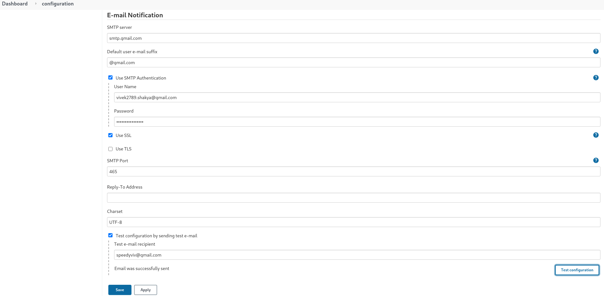
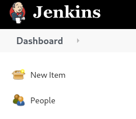
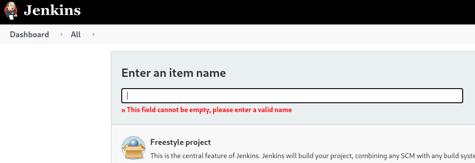
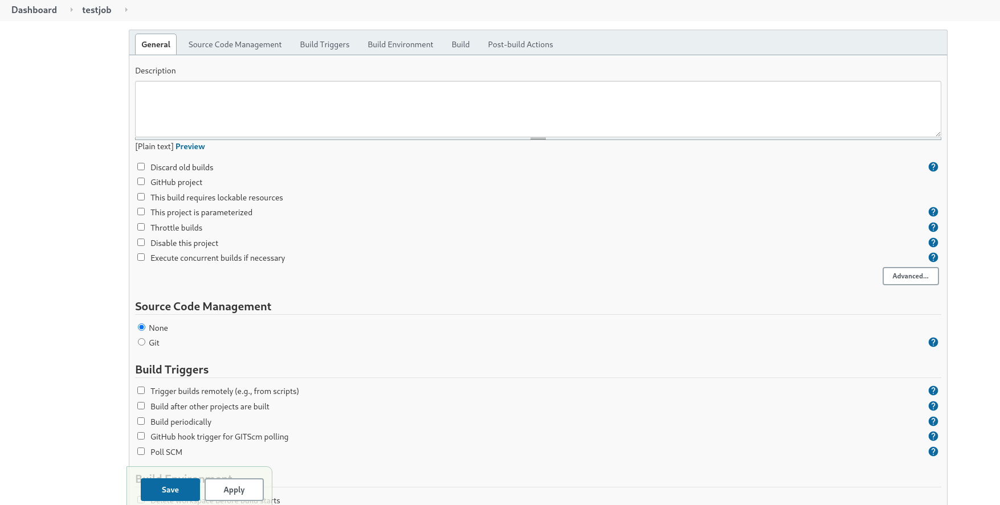
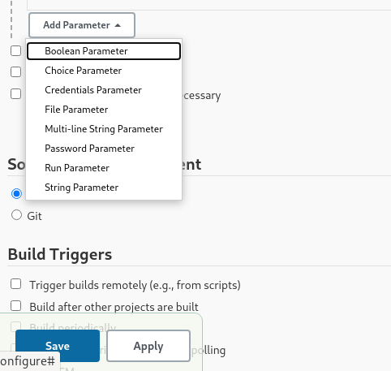
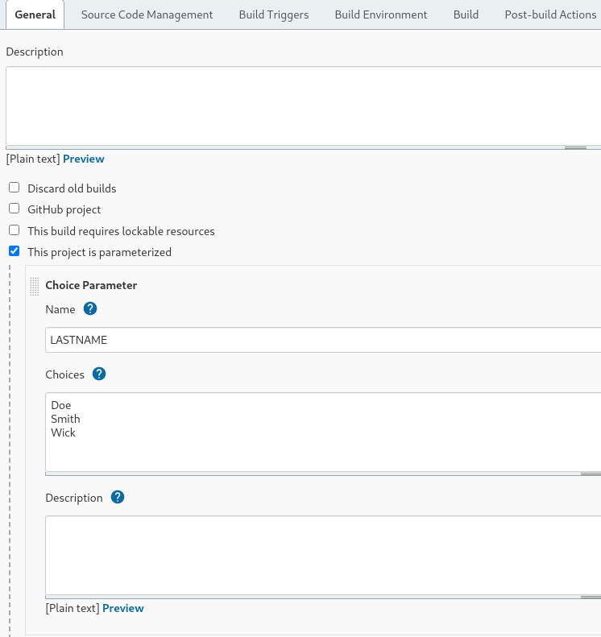
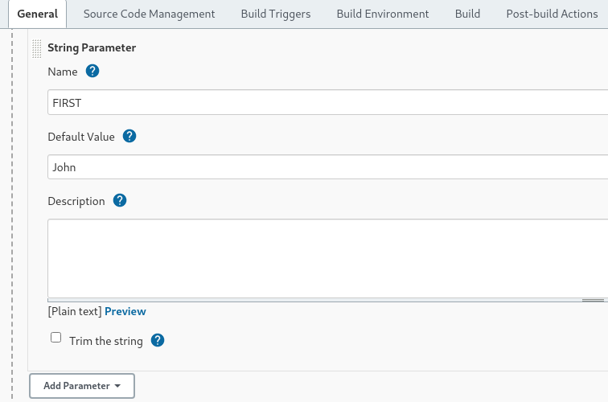
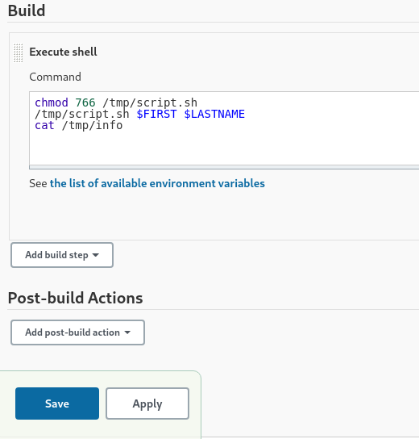
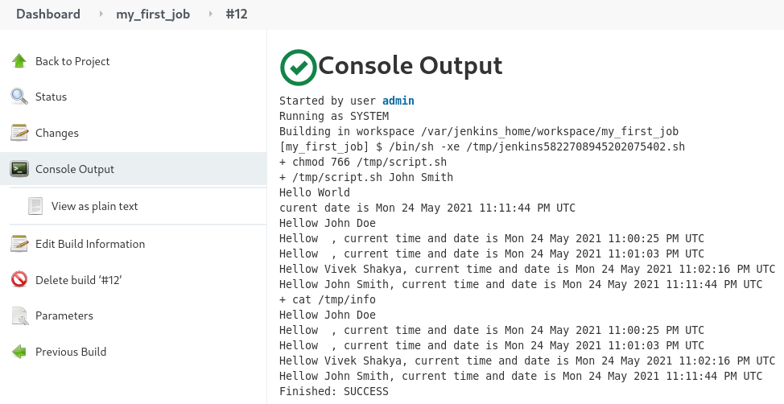

# jenkins_docker

# Install docker on fedora

      sudo dnf -y install dnf-plugins-core

- add repo

      sudo dnf config-manager \
        --add-repo \
        https://download.docker.com/linux/fedora/docker-ce.repo
        
- install docker 
       
       sudo dnf install docker-ce docker-ce-cli containerd.io

- start docker service

       sudo systemctl start docker

- verify installation
       
       docker run hello-world

- run following command if getting permission denied for "docker run hello-world"

       sudo chmod 666 /var/run/docker.sock

# Install docker-compose

- refer this doc https://docs.docker.com/compose/install/

# create a docker container for jenkins with docker running inside jenkins container

- create the Docker file to spin up jenkins container with docker installed and blue ocean plugin

       FROM jenkins/jenkins:lts-jdk11

       USER root

       RUN apt-get update && apt-get install -y apt-transport-https \
              ca-certificates curl gnupg2 \
              software-properties-common
       RUN curl -fsSL https://download.docker.com/linux/debian/gpg | apt-key add -
       RUN apt-key fingerprint 0EBFCD88
       RUN add-apt-repository \
              "deb [arch=amd64] https://download.docker.com/linux/debian \
              $(lsb_release -cs) stable"
       RUN apt-get update && apt-get install -y docker-ce-cli

       RUN groupadd docker

       RUN usermod -aG docker jenkins

       USER jenkins

       RUN jenkins-plugin-cli --plugins "blueocean:1.24.6 docker-workflow:1.26"

- docker-compose.yml file to build the dockerized jenkins contianer with docker and blueocean plugin

       version: '3.8'
       networks:
              jenkins-network:
                  name: jenkins
       volumes:
              data:
                  name: jenkins-data
              certs:
                  name: jenkins-docker-certs
       services:  
              dind:
                  container_name: jenkins-docker
                  image: docker:dind
                  privileged: true
                  restart: unless-stopped
                  networks:
                     jenkins-network:
                            aliases:
                                - docker
                  ports:
                     - 3000:3000
                  volumes:
                     - data:/var/jenkins_home
                     - certs:/certs/client
                  environment:
                     - DOCKER_TLS_CERTDIR=/certs
    
              jenkins:
                  container_name: jenkins
                  image: jenkins-ansible
                  build:
                     context: jenkins-ansible
                  restart: unless-stopped
                  networks:
                     - jenkins-network
                  ports:
                     - '8080:8080'
                     - '50000:50000'
                     - '3000:3000'
                  volumes:
                     - data:/var/jenkins_home
                     - certs:/certs/client:ro
                  environment:
                     - DOCKER_HOST=tcp://docker:2376
                     - DOCKER_CERT_PATH=/certs/client
                     - DOCKER_TLS_VERIFY=1

- run the "docker-compose build" commmand to build the images and then "docker-compose up -d" to bring up the containers
- execute "docker ps" to get the list of srunning containers
- to verify if the docker is runnnig inside the container , execute "docker exec -it <container_name> bash" to get inside the container shell and execute "docker run hello-world" . If the command is a success then docker daemon is running.

# create docker container with jenkins and ansible 

- create a directory jenkins-ansible inside jenkns-data and create a Dockerfile inside jenkins-ansible

- Dockerfile for jenkins container with ansible installed, need root permissions to install ansible hence we used "USER root" inside docker file
and then executed the apt-get update and install ansible command and switched back to USER jenkins

       FROM jenkins/jenkins

       USER root

       RUN apt-get update && apt-get -y install ansible

       USER jenkins

- docker-compose file to spin up docker container with jenkins and ansible, volumes section specify that all the data that you have inside jenkins_home directory on your local machine will be reflected in the /var/jenkins_home directory inside the jenkins docker container

       #docker compose file to spin a jenkins container only

       version: '3'
       services:
         jenkins:
            container_name: jenkins
            image: jenkins-ansible
            build:
            context: jenkins-ansible
            ports:
            - "8080:8080"     #container port 8080 will be forwarded to the localhost port 8080, localhost_port:container_port
            volumes:
            - $PWD/jenkins_home:/var/jenkins_home
            networks:
            - net
       networks:
         net: 

# create docker container with jenkins image 
- create a directory jenkins-data where we will store all the jenkins related files
       
       mkdir jenkins-data

- create docker-comapose.yml file to build up  jenkins container

       #docker compose file to spin a jenkins container only

       version: '3'
       services:
         jenkins:
            container_name: jenkins
            image: jenkins/jenkins
            ports:
            - "8080:8080"
            volumes:
            - $PWD/jenkins_home:/var/jenkins_home
            networks:
            - net
       networks:
         net: 

- execute "docker-compose build" to build the container and "docker-compose up -d" to start the container
- verify docker containers running, "docker ps" command lists all the docker containers running

- login to the container shell , "docker exec -it jenkins bash" command will ley you acces the shell inside the container, type "exit" to come out

- access jenkins UI at http://localhost:8080 , setup the jenkins admin as prompted by the jenkins UI
- install suggested plugins

# Jenkins integration with Gmail

- install the Mailer Plugin if not already installed, go to Manage Jenkins -> Manage Plugins -> type mailer in search bar under available plugin, if not found then   check in installed plugins

- follow these steps to allow gmail to send emails
   
       1. sing-in to gmail account >> navigate to settings >> privacy and security settings

       2. setup two step verification settings (because without two step verification we cannot generate application specific password)

       3. after setting up two step verification setting in gmail account navigate back to security and privacy settings

       4. click on application specific password >> give the name of the application in the drop down as Jenkins (google by default does not have any specific  application password setting for Jenkins) >> this will generate password note down the password generated

- after installing the plugin go to Manage Jenkins -> configure System -> Email Notification , configure as shown in following screen

# Create jenkins job to run a shell scripit with parameters

- after login to jenkins go to , dashboard -> new item -> enter the job name -> freestyle project -> click OK to save
   
     

- now you'll be redirected to the configure screen

   

- execute bash scripts with parameters from jenkins
- create bash script in local machine
- copy the script to docker container , container_name:file location wher you want to copy, sample script.sh file is provided in the repository 

       docker cp script.sh jenkins:/tmp/script.sh

- add prameters as shown in the following screen, I selected the choice(list) parameter and string parameter

    

- choice(list) parameter

    

- string parameter, can set default value for this
   
   

- add the shell script in the build step
  
   

Note: if jenkins user doesn't have permissions to execute scripts then grant required permissions using chmod command

- Save the job and go back to the , dashboard -> your job -> click "Build with Parameters" , if you have no parameters setup this button will simply be "build Now"

- click on the job id -> console output , to view results
   
   

    

    
